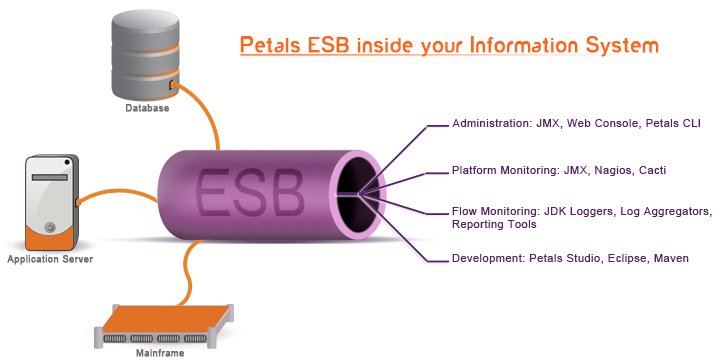

Petals ESB is an open-source Enterprise Service Bus (ESB) provided by the OW2 Middleware Consortium. 
More concretely, Petals ESB is a Java platform based on SOA principles to interconnect heterogeneous systems, applications and services. It acts as a mediation and a communication layer in Information Systems. Its architecture and supported standards make it a valuable solution for both integration and SOA projects.

One of the key features of Petals ESB is its distributed aspect, which can be seen as an alternative to cluster solutions.
Several physical Petals servers can constitute virtually a single bus. Coupled to SOA principles, this gives a lot of flexibility in the architectures that can be implemented with Petals (high availibility, fail-over, mirroring...). Communications between systems are resolved as message exchanges between service providers and service consumers, their relation being controlled by a contract. Mapping applications and systems with service providers and consumers improves the system modularity and leverages loose coupling between applications.

Petals ESB supports several communication protocol (SOAP over HTTP/S, Mail, FTP, SFTP...). It also supports several standards, including web services, WS-Security, XSLT, XML Schema... Petals ESB comes with tools for various users and project stages, from development to administration and monitoring tools. [Read more about Petals ESB features]({{ site.url }}overview.html#features).

	

